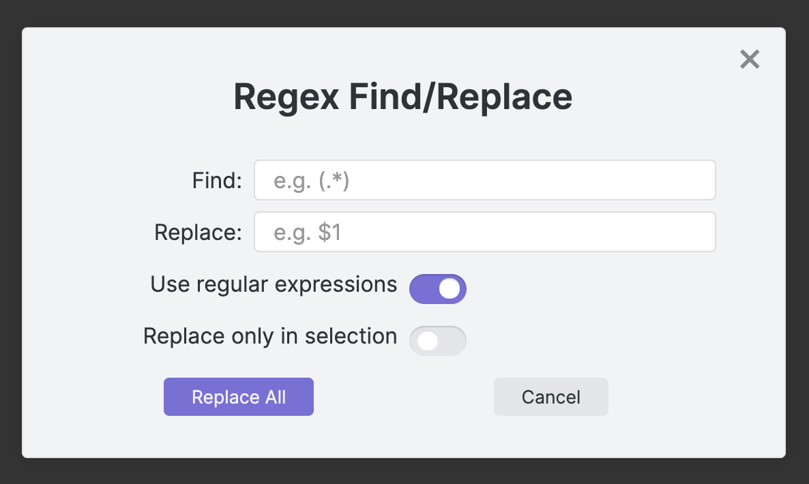

# Obsidian Plugin - Regex Find/Replace
Provides a dialog to find and replace text in the currently opened note.

## Options
- Use regular expressions or just plain text
- Replace occurances in the currently slected text or in the whole document

## How to use
- Run `Regex Find/Replace: Find and Replace using regular expressions` from the command palette or
- Assign a shortcut key to this command and use it to open the dialog
- The plugin will remember the last recent search/replace terms as well as the settings

## How to install
### From inside Obsidian
This plugin can be installed via the `Community Plugins` tab in the Obsidian Settings dialog:
- Disable Safe Mode (to enable community plugins to be installed)
- Browse the community plugins searching for "regex find/replace"
- Install the Plugin
- Enable the plugin after installation

### Manual installation
The plugin can also be installed manually from the repository:
- Create a new directory in your vaults plugins directory, e.g.   
   `.obsidian/plugins/obsidian-regex-replace`

- Head over to https://github.com/Gru80/obsidian-regex-replace/releases

- From the latest release, download the files
   - main.js
   - manifest.json
   - styles.css

  to your newly created plugin directory
- Launch Obsidian and open the Settings dialog
- Disable Safe Mode in the `Community Plugins` tab (this enables community plugins to be enabled)
- Enable the new plugin
